# Zarr Time Chunk Benchmarking

## introduction

This report demonstrates the benefit of storing NLDAS-3 data in a
zarr-like medium that is chunked more heavily across time. It
includes visualizations and analysis for multiple chunk
configurations on the NLDAS-3 grid. It presents benchmark results
based on a 1000x1800 subdomain of a single variable's daily data over
5 years (1826 days), which is stored in the NLDAS-3 s3 bucket
for each of the tested chunk variations.

   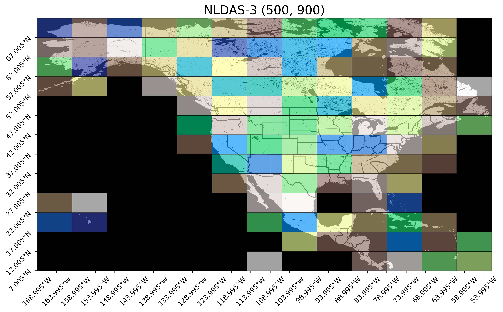

The figure above illustrates the current chunk layout on the NLDAS-3
grid. Each chunk is sized (500, 900) on the (6500, 11700) grid,
and 112/169 ≈ 66.3% of them contain a valid land point. The following
analysis will not consider empty chunks because they have extremely
high compression ratios, and shouldn't be commonly queried anyway.

Since only one time step is contained in daily netCDF files, the
time axis has a chunk size of 1. Currently, 8,400 chunks must be
queried and downloaded to acquire the 23-year period of record for
a single pixel, which amounts to 15.12 GB of uncompressed data needed
to extract the 33.6 KB pixel column (about a 20 minute download).
At the same time, a single timestep across the full spatial domain
takes around 15 seconds to download ≈300 MB of uncompressed data.

In fact, if the number of bytes per chunk were to stay the same but
the sizes of of chunk dimensions were proportional to the size of
the period of record, daily data shaped (time, latitude, longitude)
would have chunk size (75, 58, 104), and hourly data would have
chunk size (622, 20, 36).

Most use cases for NLDAS-3 data involve some kind of time dependency
(ie climatological, moving average, forcing), and are likely to have
a spatial scale that is better captured by tiles smaller than about
500x900 km (ie hydrologic units, ecoregions, point locations).

This report seeks to make informed recommendations on how we can
better support these use cases, however the chosen configuration
will ultimately be a compromise between:

1. **spatial efficiency vs temporal efficiency**
   - Chunks that are spatially larger are less efficient for querying
     a subset across time, and vice-versa.

2. **chunk utilization vs number of requests**
   - Small chunks have more request overhead, but are more adaptable
     to sparse access patterns.

## benchmark domain

The table below provides an overview of the candidate chunk layouts
benchmarked for this report. N indicates the number of chunks along
the subscripted axes in the full 23-year period of record, and S
indicates the number of pixels per chunk along the subscripted axes.
St/(Sx Sy) measures the ratio of
time pixels per area pixel within a chunk.

lat (Sy) | lon (Sx) | time (St) | size/chunk (MB) | Nt | Nx Ny  | St/(Sx Sy)  (x 103)
--- | --- | --- | --- | --- | --- | ---
500 | 900 | 1 | 1.8 | 8400 | 169 | 0.002
325 | 650 | 1 | 0.845 | 8400 | 360 | 0.005
250 | 450 | 1 | 0.45 | 8400 | 676 | 0.009
500 | 300 | 1 | 0.6 | 8400 | 507 | 0.007
260 | 260 | 1 | 0.2704 | 8400 | 1125 | 0.015
130 | 260 | 1 | 0.1352 | 8400 | 2250 | 0.030
| | | | | |
500 | 900 | 8 | 14.4 | 1050 | 169 | 0.018
325 | 650 | 8 | 6.76 | 1050 | 360 | 0.038
250 | 450 | 8 | 3.6 | 1050 | 676 | 0.071
500 | 300 | 8 | 4.8 | 1050 | 507 | 0.053
260 | 260 | 8 | 2.1632 | 1050 | 1125 | 0.118
130 | 260 | 8 | 1.0816 | 1050 | 2250 | 0.237
| | | | | |
500 | 900 | 16 | 28.8 | 525 | 169 | 0.036
325 | 650 | 16 | 13.52 | 525 | 360 | 0.076
250 | 450 | 16 | 7.2 | 525 | 676 | 0.142
500 | 300 | 16 | 9.6 | 525 | 507 | 0.107
260 | 260 | 16 | 4.3264 | 525 | 1125 | 0.237
130 | 260 | 16 | 2.1632 | 525 | 2250 | 0.473
| | | | | |
500 | 900 | 24 | 43.2 | 350 | 169 | 0.053
325 | 650 | 24 | 20.28 | 350 | 360 | 0.114
250 | 450 | 24 | 10.8 | 350 | 676 | 0.213
500 | 300 | 24 | 14.4 | 350 | 507 | 0.160
260 | 260 | 24 | 6.4896 | 350 | 1125 | 0.355
130 | 260 | 24 | 3.2448 | 350 | 2250 | 0.710
| | | | | |
500 | 900 | 32 | 57.6 | 263 | 169 | 0.071
325 | 650 | 32 | 27.04 | 263 | 360 | 0.151
250 | 450 | 32 | 14.4 | 263 | 676 | 0.284
500 | 300 | 32 | 19.2 | 263 | 507 | 0.213
260 | 260 | 32 | 8.6528 | 263 | 1125 | 0.473
130 | 260 | 32 | 4.3264 | 263 | 2250 | 0.947

Testing with 4 original (500, 900) chunks over 4 years, that's
~10.52 GB per run, or 157.8 GB total. Even with relatively large
time slices (ie 32), this would still require 46 requests which
should saturate bandwidth and concurrency, so hopefully will still
serve as a good basis for extrapolation to larger grids/time periods.

## benchmarking methodology

  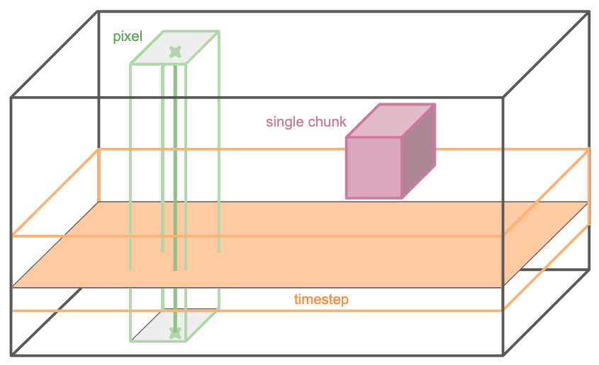

First, a single-variable float32 (time, lat, lon) subgrid with size
(1826, 1000, 1800) was created for each of the chunk layouts in the
table, and stored as a ≈13.147 GB zarr array on the s3 bucket.
This domain captures daily 2014-2018 air temperature over the region
from 32 to 42 latitude and -97 to -79 longitude, an area containing
97.2% land points.

A series of requests are issued to the s3 bucket, each using
one of the four access patterns below. The total amount of time it
takes to load all the data from each request is recorded. The
differences between these access patterns is illustrated by the
figure above.

1. random single pixel column
2. random single time slice
3. random single chunks
4. several random chunks

Each access experiment was repeated 64 times in random order, and
using randomly-selected pixels, timesteps, or chunks depending on
the test type. Since experiments were run simultaneously, bandwidth
limitations should uniformly affect the results.

We chose not to test selecting random small subsets since the
performance will be highly sensitive to chunk boundaries, and as
such results will be predictable from the above measurements and the
number of chunks intersected.

  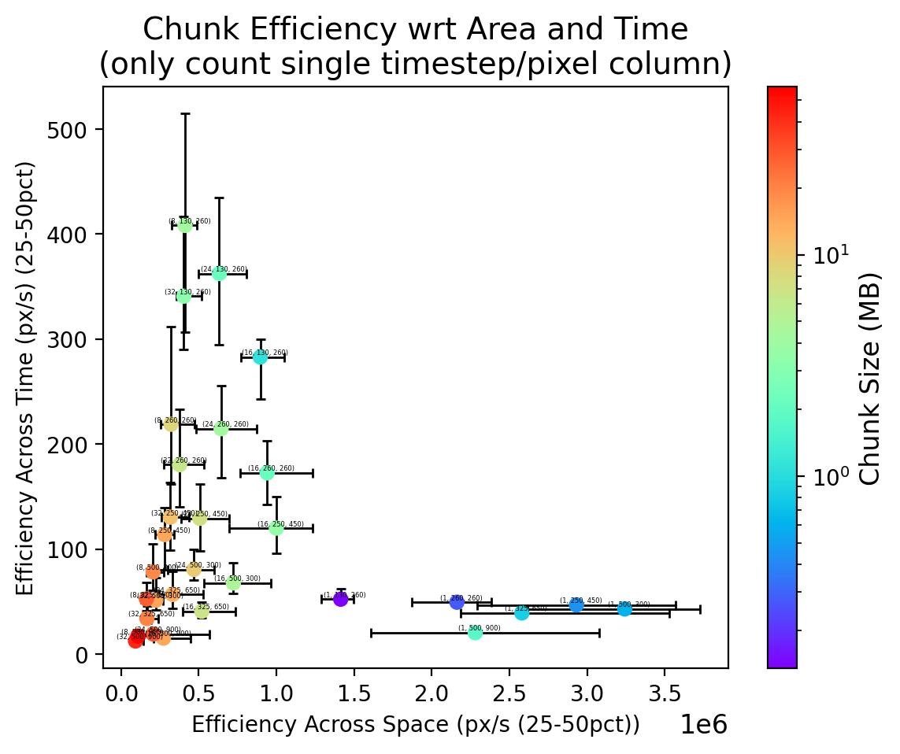
  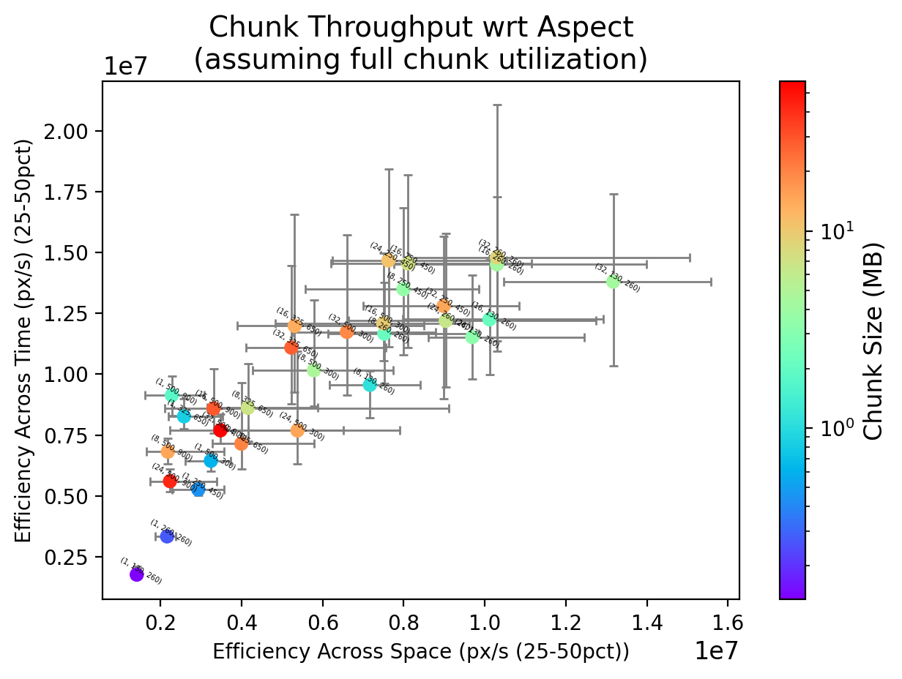

The figures above both compare the efficiency of indexing each
chunk layout across space and time. The efficiency calculation
for the image on the left only counts points that are part of a
single time step pixel column, while the image on the right assumes
that all pixels within a chunk are utilized.

First notice that in general, larger chunk sizes are favored when
more complete chunk utilization is anticipated, and smaller chunk
sizes are best for sparse access.

For example, the single-timestep chunks are significantly more
efficient at indexing across space when only one time step is
parsed at a time, however even for spatial indexing, their advantage
disappears when adjecent timesteps in the chunk can also be utilized.

Configurations like (24, 250, 450), (24, 260, 260) seem to offer a
decent middle ground given these observations, however the axes are
skewed by at least an order of magnitude. Even assuming full chunk
utilization, the fastest throughputs indexing across time are less
than half as fast as the median speed of tested configurations when
indexing across space. This suggests that it may be reasonable to
to lean more heavily toward even larger time chunks.

  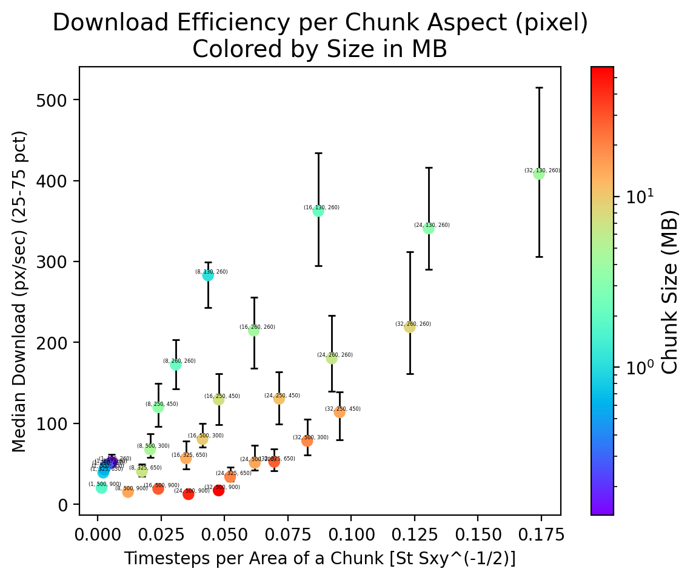
  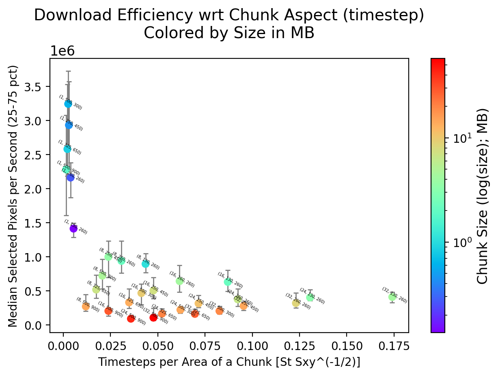

In these figures, we look at spatial and temporal access patterns
separately in order to better understand how the portion of time
steps per unit area in a chunk (here on the *aspect*) and the size
of chunks impacts their throughput.

The figure on the left clearly shows that as the ratio of time points
per chunk increases,

Curiously, when indexing across the spatial domain, smaller chunks
like (16, 130, 260) (around 2.1 MB) are more efficient at getting
sparse timestep data than larger chunks like (8, 500, 900), which
is around 14.4 MB.

  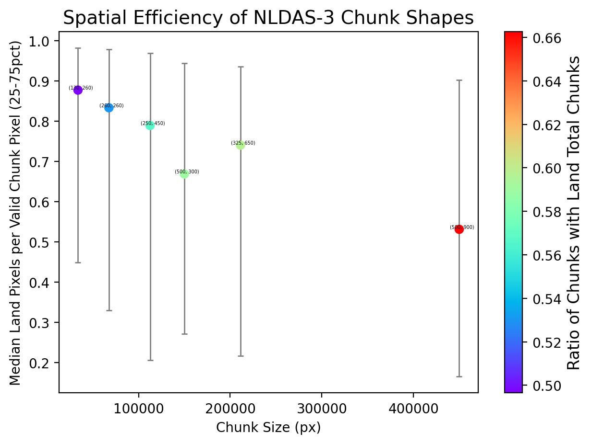

  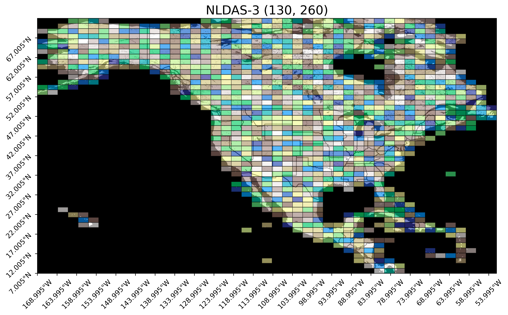
  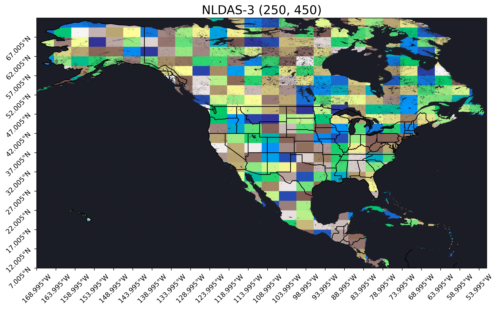

The top image above shows the spatial efficiency of each area
configuration in terms of the median number of valid land points
that each chunk contains (ignoring empty chunks). The efficiency
generally trends downward as chunks grow since they capture islands
and wrap coastlines less efficiently. The images below visualize
this principle with candidate chunks of (130, 260) and (250, 450).

  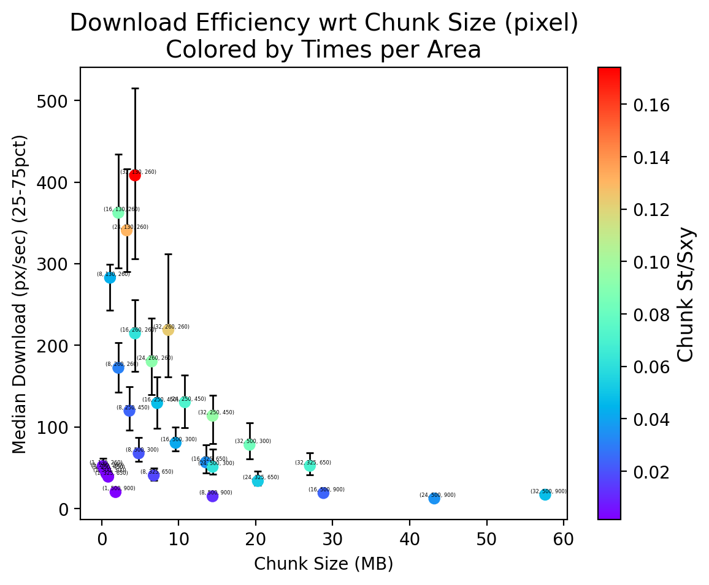
  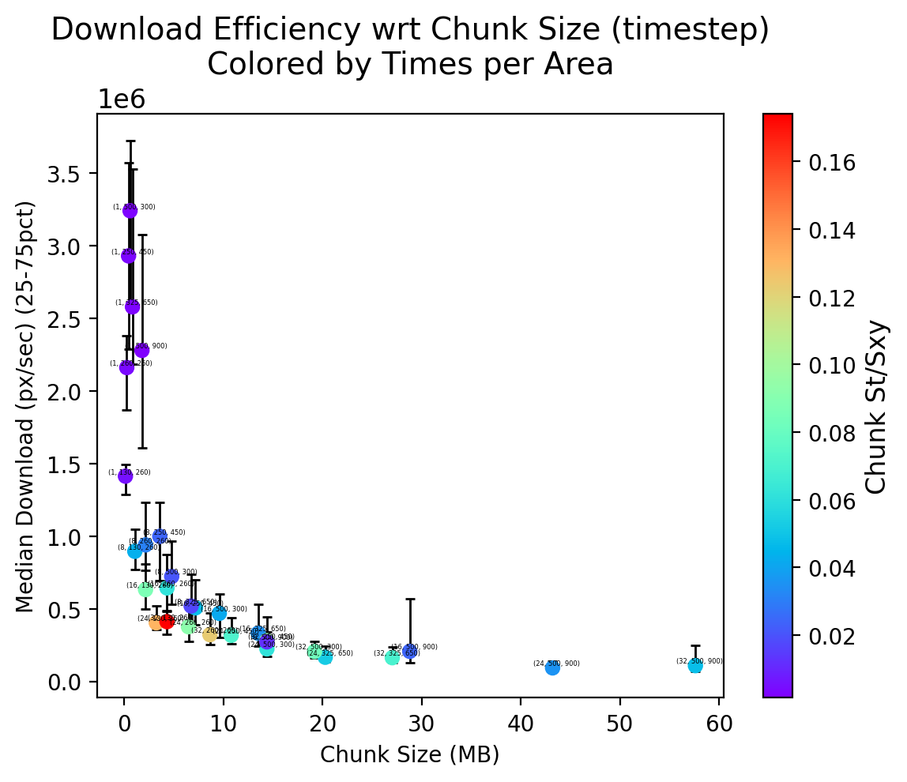
  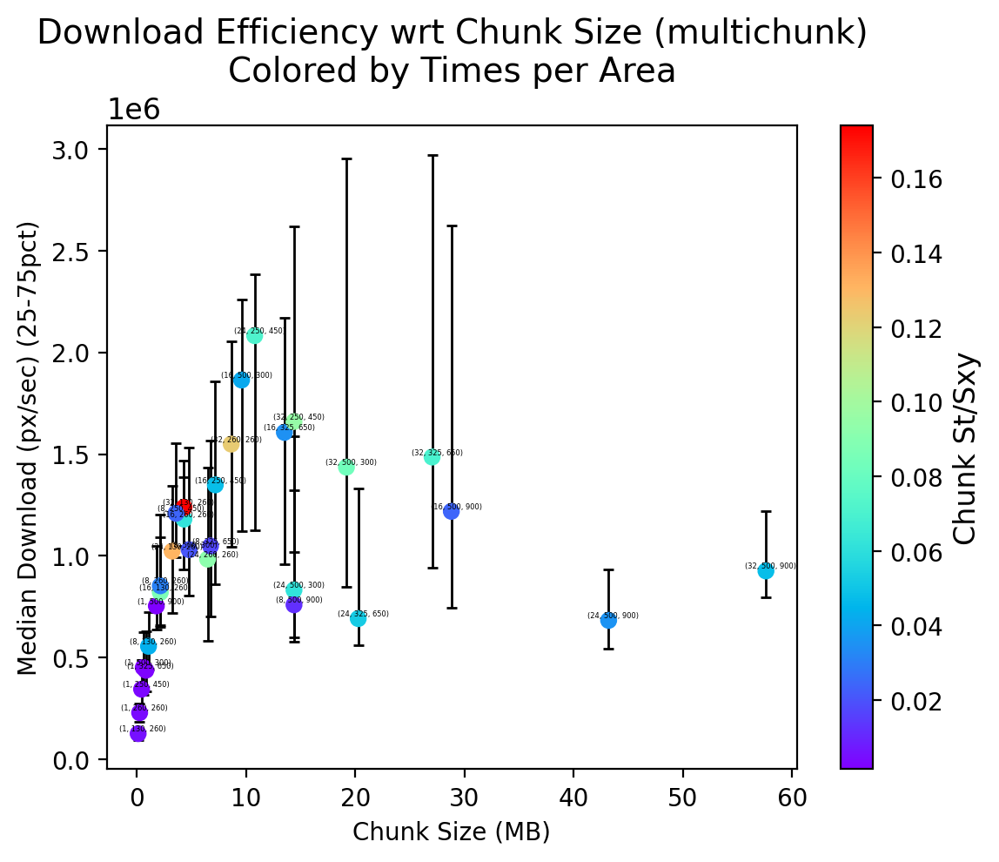

The figures above capture the download bit rate of valid points
for a full pixel column, a full domain timestep, and a full chunk,
with respect to their chunk size and aspect (colored).

## notes

visualize with plot of px/sec on y axis and Nxy/Nt on x axis for
each configuration. Separate plots for each access method.

Keep in mind that the chunk-based retrievals are the most
untrustworthy since they include partial chunks that won't be
present in the final dataset (since this subset's size doesn't
necessarily have the chunk size as a factor) and will be affected
by the same latency overhead as all others. use the

Note also that partial chunks affect spatial and temporal indexing.

Really, I should add a new test type that guarantees full chunks are
indexed at a time in order to regress latency. or perhaps even
better a conditional for all test types, and a new test for
arbitrarily shaped but constrained contiguous subsets.

**visualizations**

- scatterplot x: `time_start`, y: `dt_init`
  per test type, color by cache configuration

- scatterplot x: `time_start+dt_init`, y: `dt_load`
  per test type, color by cache configuration

- scatterplot per test type x:`N_xy/N_t` y: median points/sec w/ IQR

- nested bar plot grouped by chunk configuration. each group has
  bar for median points/sec with IQR of each test

- overall scatterplot and linear regression of number of points
  per request vs `dt_load` to estimate latency overhead

### simulate for full grid:

1. chunks per pixel column
2. chunks per time slice
3. mean chunks per watershed
4. spatial points loaded per watershed
5. number of chunks with/without valid land
   (or mean valid points per chunk)
6. points loaded/points included per watershed

### end goals

- develop a regression relationship between size/aspect configuration
  based on benchmark observations

- demonstrate how the number of chunk intersections is related to
  the chunk shape and request shape; characterize alignment?

- show the relationship between request size/shape, number of chunks
  requested, and download time

### thoughts
