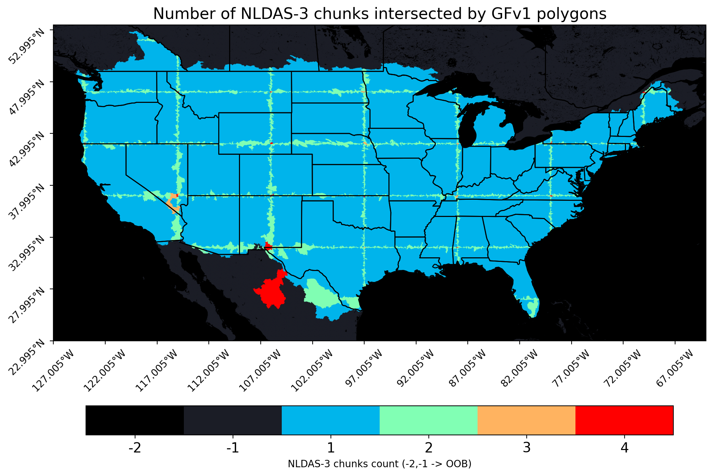

# scripts

This is an assortment of specialized demo scripts for interacting
with NLDAS-3 data.

## read\_nldas3\_kerchunk\_from\_refs.py

Demonstrate how to load data from kerchunk references by generating
an animation from a subgrid time series.

## calc\_gfv1\_nldas3\_overlap.py

Make an adjacency matrix between hydrologic polygons and NLDAS-3
chunks, which can be used for load-balancing to avoid redundant
downloads.

The `nldas3_chunks_all.npz` file needed to run
`calc_gfv1_nldas3_overlap.npz` is available in the `data/`
subdirectory, and may be created by `get_nldas3_chunk_polygons`
from `benchmarks/zarr_time_chunk/create_nldas3_chunk_polygons.py`,
using the default chunk shape of NLDAS-3 which is (1, 500, 900).

## plot\_gfv1\_nldas3\_overlap.py

   

Given the outputs of `calc_gfv1_nldas3_overlap.py`, plot a figure
like the one above indicating how many NLDAS-3 chunks are needed
to load each of the GFv1 hydrologic unit polygons.
